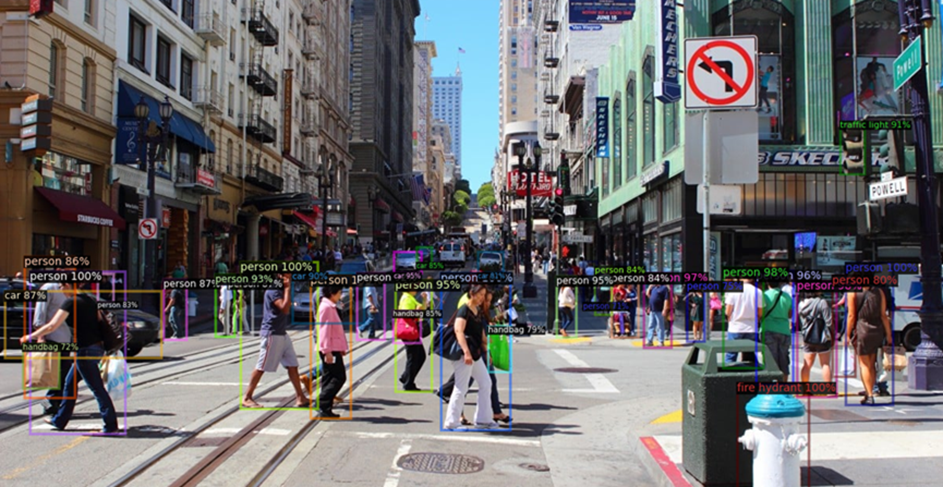
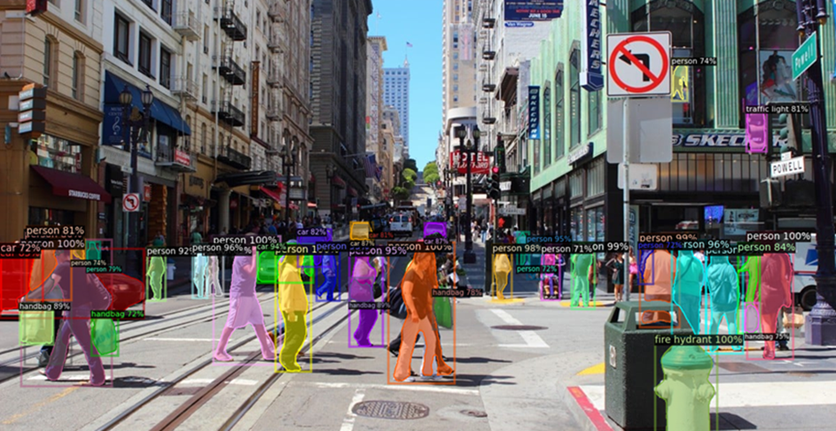
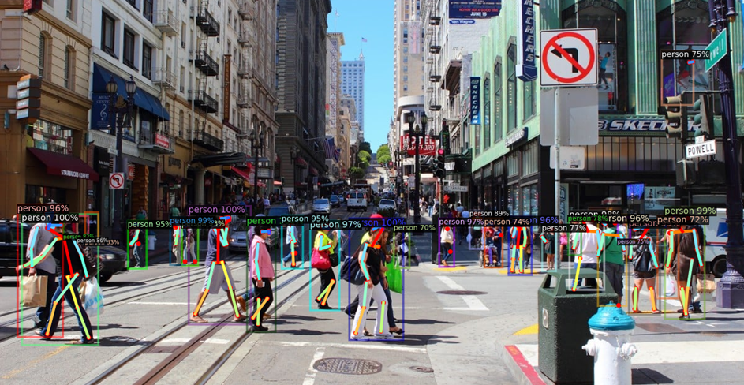
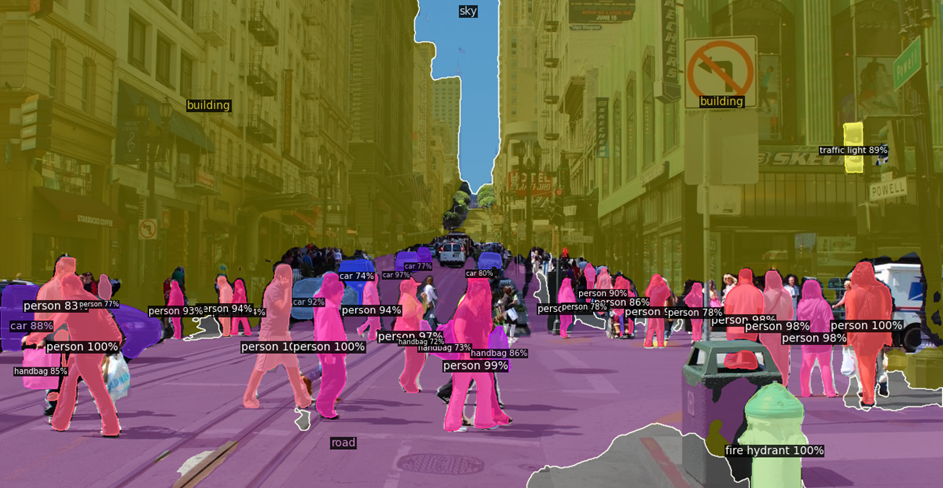
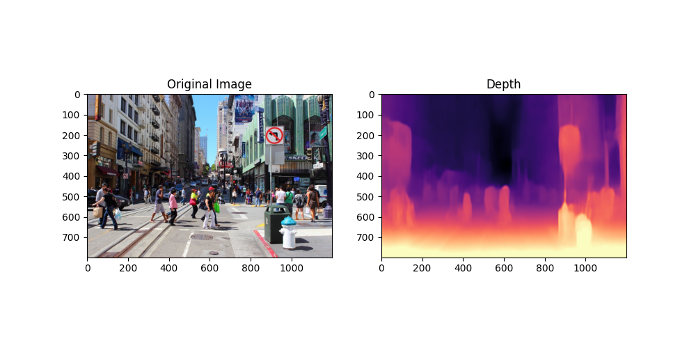
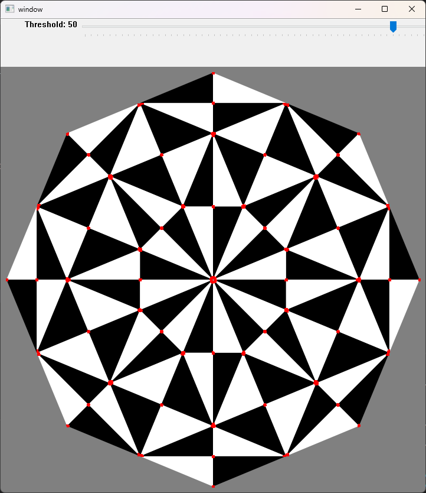

## Experiments

These experiments are done to gain a better understanding of the semantics and performance of state-of-the-art computer vision algorithms.

#### `detectron2_test.py`

Based on the [detectron2](https://github.com/facebookresearch/detectron2) package. This program takes an image or video as input and performs one of the 4 computer vision tasks. Supported tasks include: 

- object detection: locate and identify instances of objects in an image.

- instance segmentation: locate and identify instances of objects in an image, then demarcate these objects by identifying their boundaries.

- keypoint detection: localising key points of the human body like joints, shoulders, hips etc.

- panoptic segmentation: combines semantic segmentation with instance segmentation.

#### `manydepth_test.py`
Based on the [manydepth](https://github.com/nianticlabs/manydepth) package. This program takes an image or video as input and performs self-supervised monocular depth estimation.

#### `corner_detection_test.py`
This program uses OpenCV Harris corner detection to detect corners in a given image. Users are able to configure the detection threshold to suit the needs of different images and directly preview the result.

