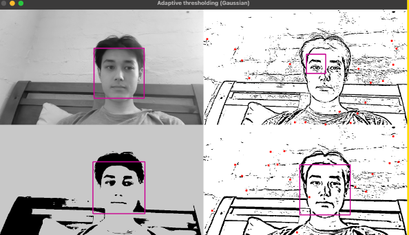

## Experimental JetBot programs

The NVIDIA Jetson Nano robot comes with a variety of pros and cons. However, a large limitation it yields is due to its relatively low processing power.

Despite being equipped with an onboard graphics card, the processing power of the JetBot is **significantly lower** than that of a personal computer.

A large portion of the work I have done in the latter part of the year is to research potential, low-demand methods which will allow our computer vision module aboard the JetBot to function smoothly.

This directory serves as an archive of these programs.

### jetbot/util

These files were used to determine ideal threshold values to use in more sophisticated programs.

#### util/edgetest.py

Given static hallway images, the purpose of this program was to manually determine the clearest **max/min thresholds** to use for `cv2.Canny()` edge detection. 

#### util/threshold.py

This file would test how different types of image thresholding impacted the accuracy of corner and face detection using cascade classifiers. 

An example is shown below with these given types of thresholding:

- Bottom left - Simple binary global thresholding
- Top right - Adaptive mean thresholding - small blocksize (smaller neighbourhood around a pixel to determine it’s threshold value)
- Bottom right - Adaptive mean thresholding - large blocksize with more leniency (larger C subtracted from mean value determined from block)

