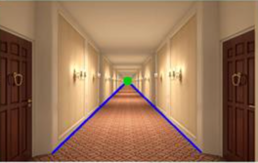
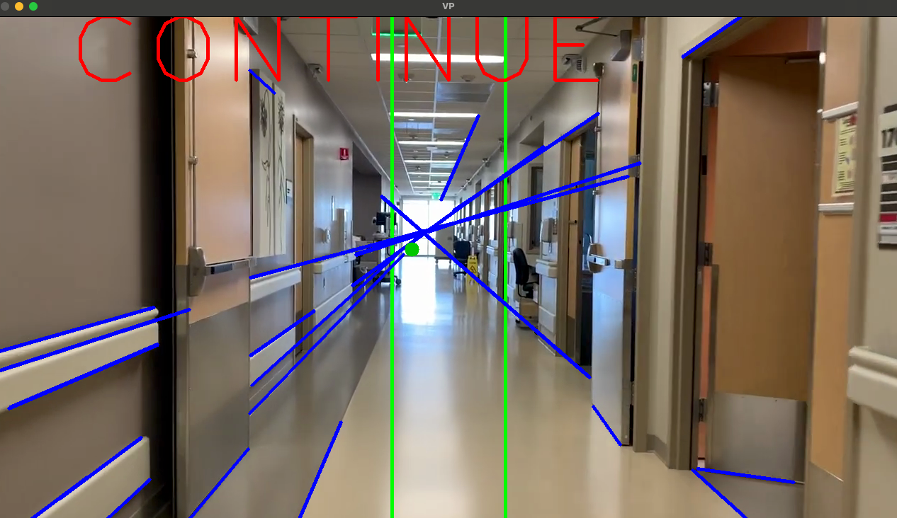

## Experimental JetBot programs

The NVIDIA Jetson Nano robot comes with a variety of pros and cons. However, a large limitation it yields is due to its relatively low processing power.

Despite being equipped with an onboard graphics card, the processing power of the JetBot is **significantly lower** than that of a personal computer.

A large portion of the work I have done in the latter part of the year is to research potential, low-demand methods which will allow our computer vision module aboard the JetBot to function smoothly.

This directory serves as an archive of these programs.

### jetbot/util

These files were used to determine ideal threshold values to use in more sophisticated programs.

#### util/edgetest.py

Given static hallway images, the purpose of this program was to manually determine the clearest **max/min thresholds** to use for `cv2.Canny()` edge detection. 

#### util/threshold.py

This file would test how different types of image thresholding impacted the accuracy of corner and face detection using cascade classifiers. 

An example is shown below with these given types of thresholding:

- Bottom left - Simple binary global thresholding
- Top right - Adaptive mean thresholding - small blocksize (smaller neighbourhood around a pixel to determine it’s threshold value)
- Bottom right - Adaptive mean thresholding - large blocksize with more leniency (larger C subtracted from mean value determined from block)

#### util/lineDetector.py

A simple program designed to find which upper and lower bounds for the method `cv2.inRange()` yield the best results of filtering out certain colours.

This was created in anticipation that our navigation would be based off following certain coloured lines, and therefore I wanted to find a way to filter out the road we wish to follow.

### jetbot/navigate

These files were more experimental implementations on how the jetbot could potentially navigate.

#### hallwayEdge.py

The first attempt at a potential navigation solution takes advantage of the environment the jetbot could potentially find itself in: a **nursing home**.

The idea revolves around detecting the hallway's floor-wall edge, and seeing if this edge intersects a given bounding box. If so, adjust the robot's orientation accordingly. 

This simple program uses a variety of filtering (bilaterial, gaussian blurring, grayscale) to best achieve an edge detection using the `cv2.houghLines()` method.

These are the results of this edgeDetection algorithm run on a wall with shutters.

Ultimately, the limitation in using this method is that the robot doesn't have a way of maintaining a record of its position in its surrounding environment.

#### staticImageTest.py

Through online research, I came across using the 'vanishing point' as a reference to navigate towards. Then, depending on the relative position between the vanishing point and the center of the image, we can specify the jetbot to turn a certain way down a hallway.

Here is an example of the vanishing point on a static hallway image.

#### vanishingPoint.py

This algorithm was then run on a video, for which it ran relatively smoothly, comfortable sitting above 30 fps.

#### vision.py

This file contains the class used for the vanishing point implementations